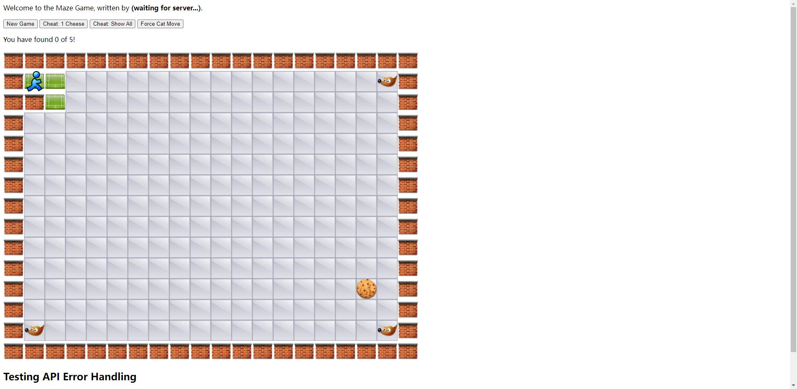
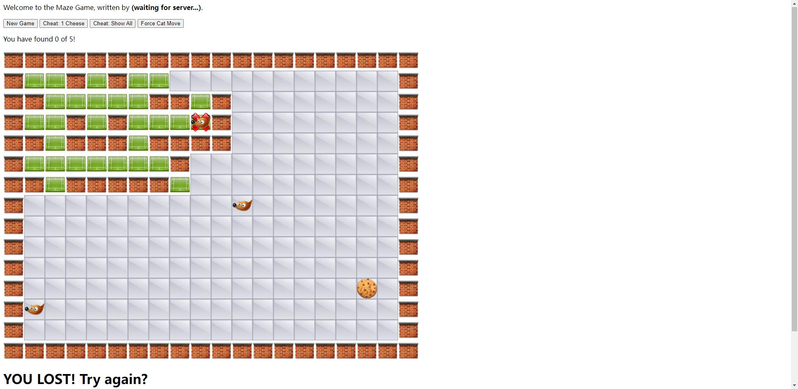

# Maze

## Feature
* Recursive division to create maze
* Spring boot with rest api

## Function 
* Start the project at local host 8080(default)
* Player need to find all 5 cookies to win, and will lose if touch the fox

* Allow you cheat, find one cookie to win and show all map.
! [plot](./maze5.jpg)
! [plot](./maze4.jpg)
